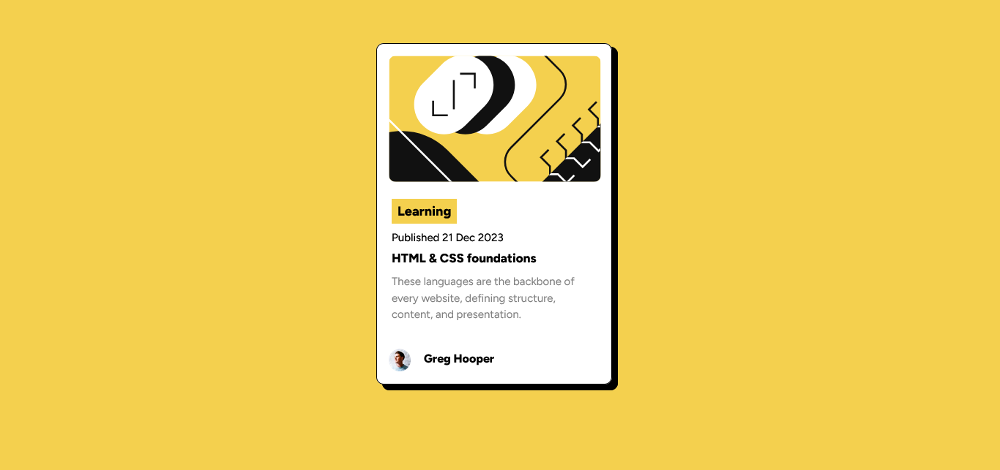

# Blog-Preview-Card

## Overview

### The challenge

Users should be able to:

- See hover and focus states for all interactive elements on the page

### Screenshot



### Links

- Solution URL: [https://github.com/RachelAbit/Blog-Preview-Card]
- Live Site URL: [Add live site URL here](https://your-live-site-url.com)

## My process

The first thing I did is I create an HTML document, I used semantic tags and container. After I build the basic structure
of my project, I use CSS for styling, I put some basic styling like fonts, color etc and I add hover effects and clamp function to create changes when size become smaller.

### Built with

- Semantic HTML5 markup
- Flexbox
- CSS Grid
- CSS function
- No framework

### What I learned

I know the basic HTML and CSS such as creating the structure of HTML document for HTML and I know some functions of CSS like clamp(), calc(), min() and max() but I rarely used them when I practicing CSS. Since, I have a basic knowledge of these two it's not hard for me to create this project.

I'm mostly proud of this
```css
.container:hover{
    transform: scale(1.01);
    box-shadow: 10px 10px 0px 0px rgba(0,0,0,1);
    background-origin: 10px;
    .title{
        color: hsl(47, 88%, 63%);
    }
}

and 

.main-details{
    font-size: clamp(14px, 2vw, 15px);
    line-height: 1.5;
    color: hsl(0, 0%, 50%);
}
```

### Continued development

For improvement, I want to learn more about:
- CSS Frameworks
- CSS Animation
- CSS Functions

### Useful resources

- [https://developer.mozilla.org/en-US/docs/Web/CSS/clamp] - This helped me for using clamp. I really liked this function and I will use it.

## Author

- Frontend Mentor - [@RacheAbit](https://www.frontendmentor.io/profile/RachelAbit)
